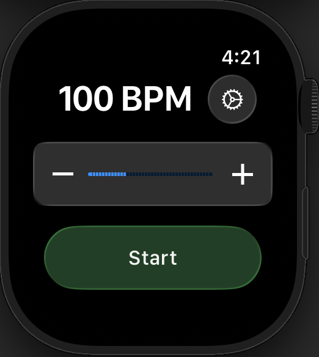

# Haptic Metronome
A clean, tactile metronome for your wrist. 
Designed to let you practice a instrument without breaking focus or sound.

## Features
1. Adjustable tempo, 40 - 240BPM.
2. Taps the tempo right on your wrist using the haptic motors.
3. Haptic types can easily be changed in the settings.
4. Automatically uses the previous BPM after closing and opening again.

## Why I made this
In my free time, I play piano. As i learned more advanced pieces i struggled to keep the tempo while playing. 
I tried different metronome apps on my phone but they were often distracting - either i couldnt concentrate or the sound was in the way to hear the piano clearly. 
So I thought: what if my watch could just quietly tap the tempo right there on my wrist instead.
That thought became this project.